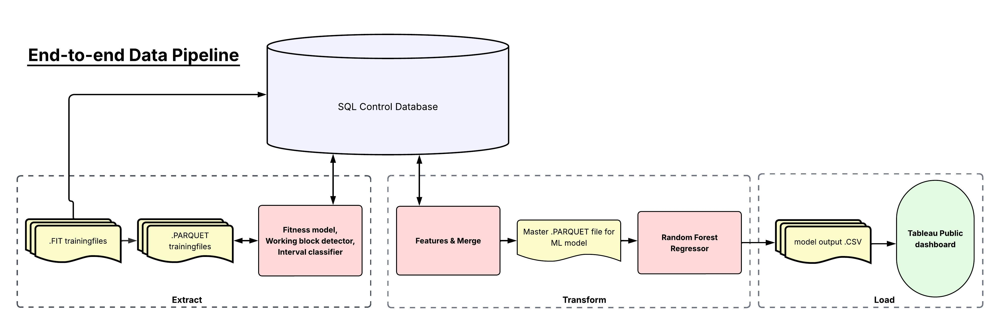
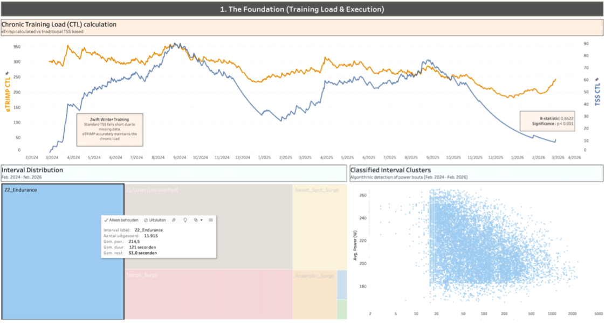

# cycling-performance-model

Reconstructing real cycling training behavior from raw FIT data and linking it to physiological adaptation using machine learning.

## Why

Most training platforms summarize training using averages such as power, heart rate, and TSS.

This project takes a different approach: instead of averaging training, it reconstructs what the athlete actually did, classifies the structure of those efforts, and links them to physiological adaptation.

## What this project does

- Parses raw `.FIT` files into structured datasets
- Converts training data into `.parquet` and SQL tables
- Detects working blocks and classifies intervals
- Captures both clean intervals and unstructured surge efforts
- Engineers physiological features such as aerobic decoupling and efficiency factor
- Applies explainable machine learning using Random Forest and SHAP
- Visualizes results in an interactive dashboard

## Pipeline Overview

## Example Output

## Key Insights

- Training quality is not determined by volume alone
- Unstructured surge-heavy training can reduce efficiency despite high load
- Structured aerobic work aligns more strongly with race-specific improvement
- The model captures training structure, not just load

## Tech Stack

- Python
- Pandas
- Scikit-learn
- SQL
- Apache Parquet
- Tableau

## Full Write-Up

This repository is the code companion to a two-part Medium case study:

- Part 1: From Raw FIT Files to Structured Training Data
- Part 2: From Data to Physiology: What Actually Makes an Athlete Better?

## Limitations

- Single-athlete dataset
- Limited observations for aerobic decoupling
- Current interval classification is rule-based
- Recovery and biomechanical variables are only partially captured

## Next Steps

- Extend to multiple athletes
- Add dynamic FTP estimation
- Move towards unsupervised interval clustering
- Integrate additional recovery and biomechanical data
